# Introducción a wireshark

- Pedro Pablo Guzmán Mayen 22111

## Parte 1

### Creación del perfil en wireshark

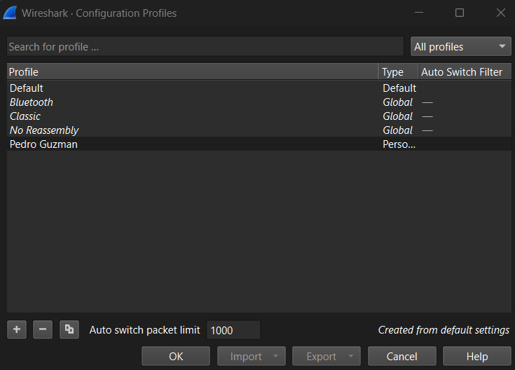

### Descargar el archivo

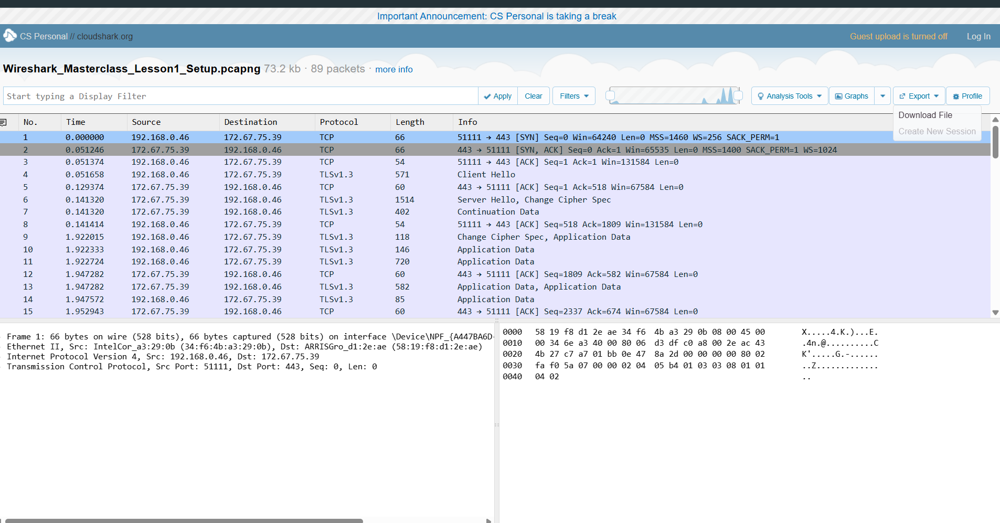

### Abrir el archivo descargado

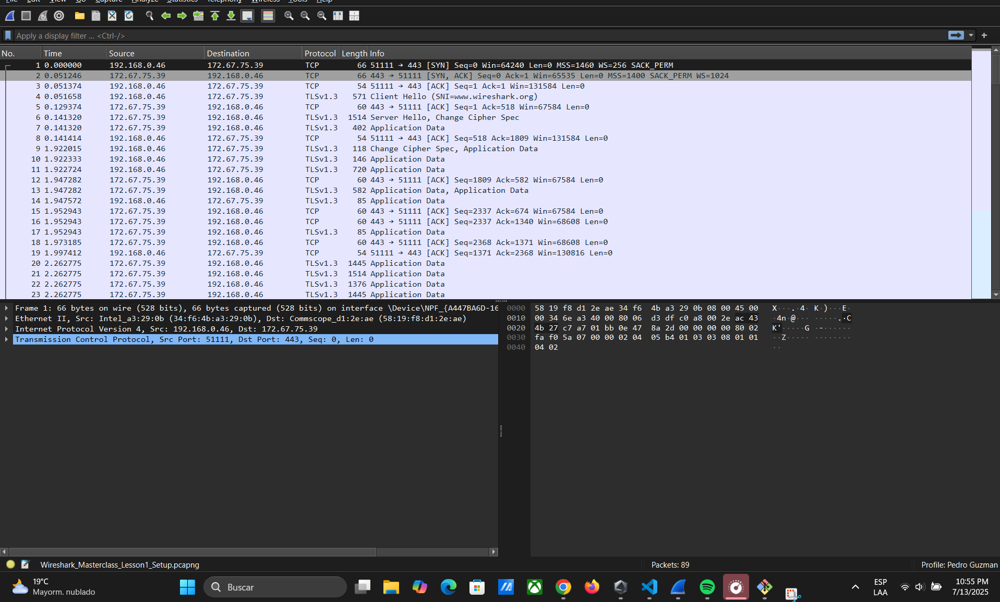

### Aplicar el formato Time of Day

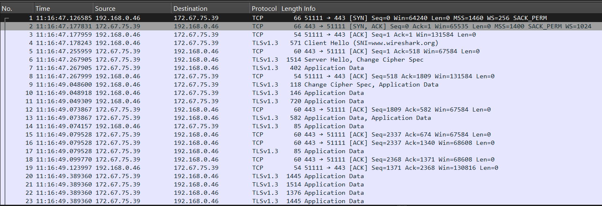

### Agregar una columna con la longitud del protocolo

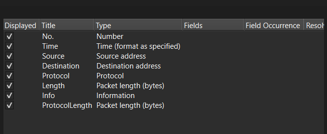

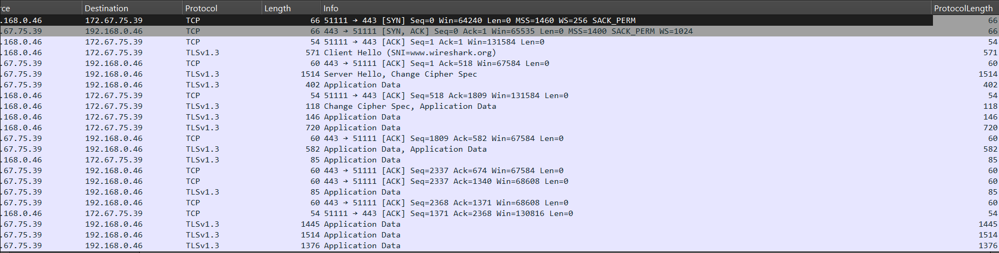

### Eliminar la columna longitud

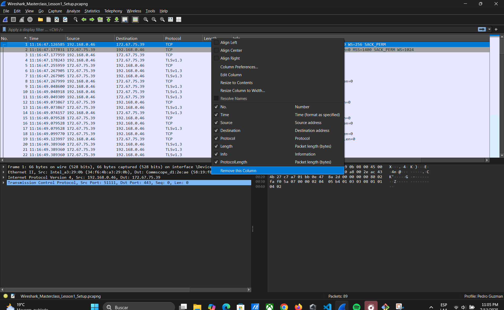

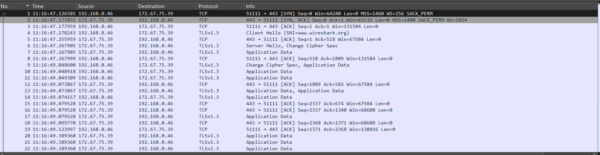

### Aplicar un esquema de paneles diferente

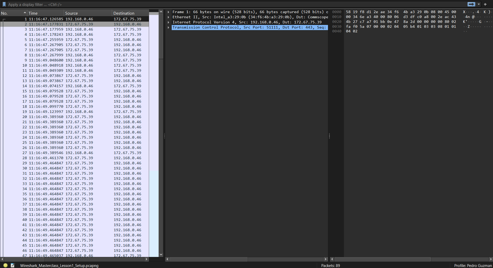

### Aplicar regla de color para el protocolo TCP

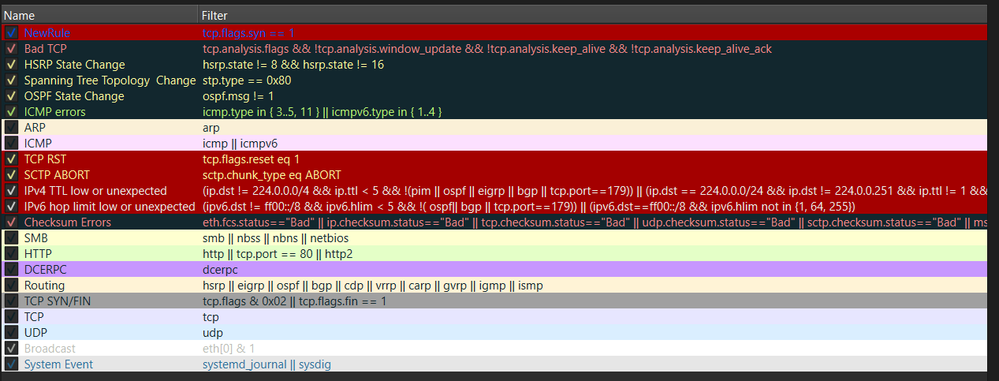

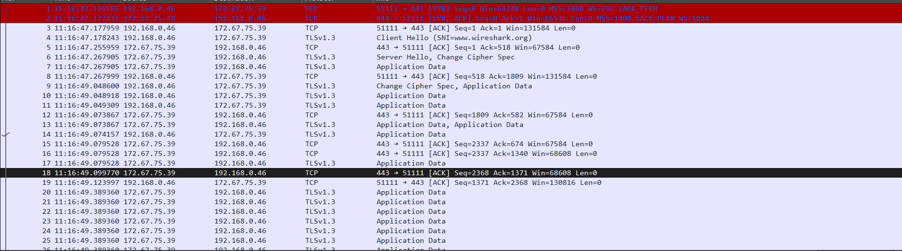

### Aplicar un filtro

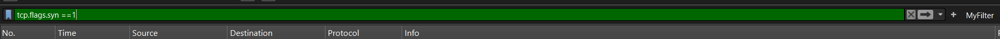

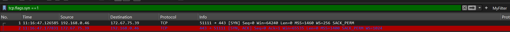

### Desactivar las interfaces 

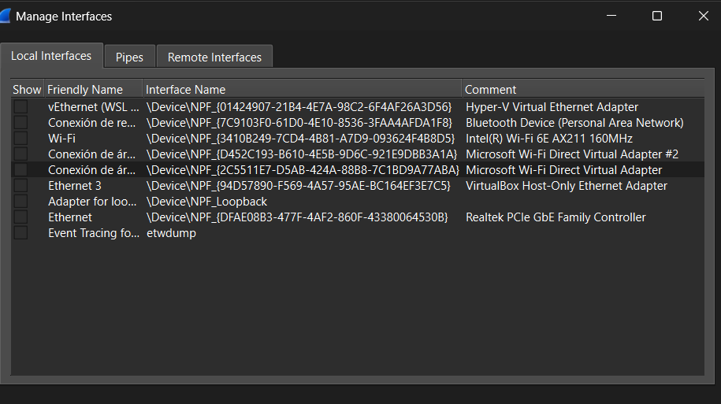

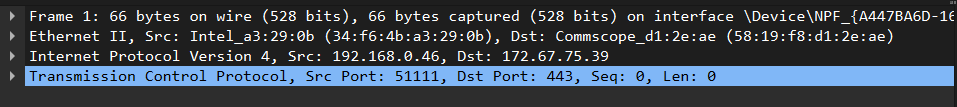

## Parte 2

### Usar el comando ipconfig o ifconfig

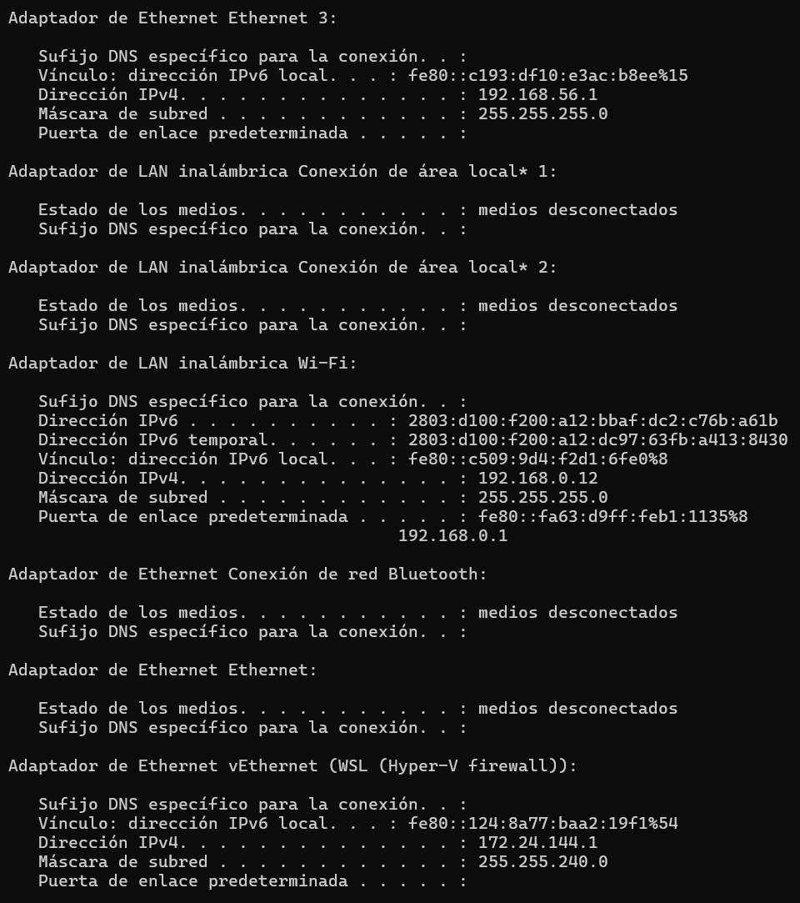

El comando ipconfig muestra como la computadora está conectada a la red y cuáles interfaces están activas. En mi caso se muestra que tengo activas las interfaces virtuales de WSL y VirtualBox las cuáles sirven para que mi computadora se comunique con dichos servicios. También se puede ver la interfaz de wifi y se muestra la ip que mi router me asignó. 

### Capturar información

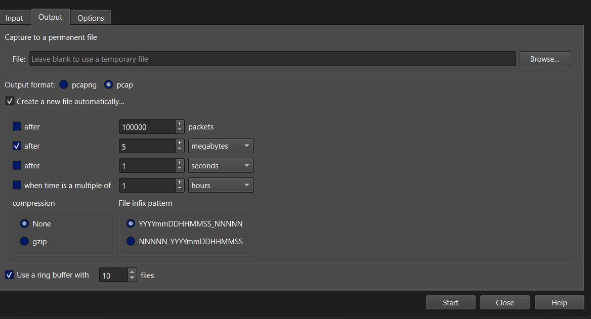

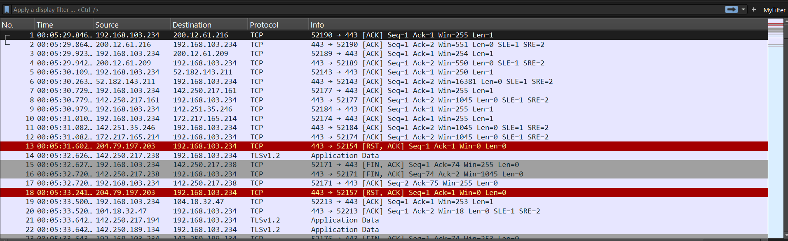

## Parte 3

### Captura de la solicitud http

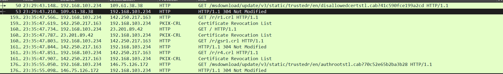

Las solicitudes al sitio indicado son las primeras en la lista

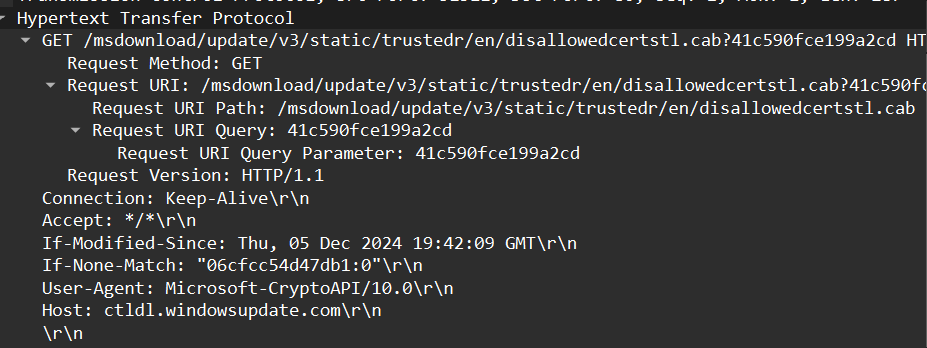

### ¿Qué versión de HTTP está ejecutando su navegador?

- El navegador ejecuta HTTP1.1

### ¿Qué versión de HTTP está ejecutando el servidor?

- También ejecuta HTTP1.1
### ¿Qué lenguajes (si aplica) indica el navegador que acepta a el servidor?

- No se indica que lengujes se aceptan.

### ¿Cuántos bytes de contenido fueron devueltos por el servidor?

- El servidor devolvió 3568 bytes

### En el caso que haya un problema de rendimiento mientras se descarga la página, ¿En que elementos de la red convendría “escuchar” los paquetes? ¿Es conveniente instalar Wireshark en el servidor? Justifique.

- Si sería conveniente también escuchar las peticiones en el servidor pues en caso de haber problemas con el navegador podríamos utilizar wireshark para tener la información de los paquetes intercambiados también en el servidor. Sin embargo esto también nos quitaría capacidad de procesamiento en el servidor pues estaríamos gastando recursos en ejecutar wireshark. 

## Discusión

- Fue una actividad bastante interesante pues aprendí a como usar una nueva herramienta para capturar tráfico de red, con esto pude notar detalles interesantes sobre la red de mi hogar pues parece haber dispositivos conectados que no recuerdo tener. 

- La actividad grupal fuebastante enriquecedora pues me dio la posibilidad de experimentar de una forma más cercana la forma de implementar un protocolo y ponerlo en práctica. 

## Comentario

- Fue una actividad bastante entretenida de hacer pues fue bastante interactiva y enriquecedora. 

## Conclusiones

- Wireshark es una herramienta bastante útil para capturar información de paquetes transmitidos a través de la red
- Las actividades grupales son enriquecedoras pues ayudan a tener una mejor idea sobre los conceptos aprendidos en clase. 

### Referencias

- 

