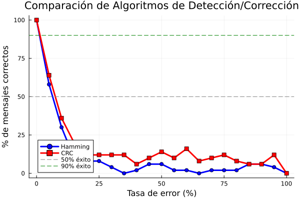

# Laboratorio 2 parte 2: Esquemas de detección y corrección de errores

- Gustavo Cruz 22779
- Pedro Guzmán 22111

---

## Descripción de la práctica

La práctica consiste en la implementación de algoritmos de detección y corrección de errores utilizando 2 lenguajes de programación diferentes, uno para escribir el código de emisor y otro para escribir el código del receptor. Los objetvos de la práctica son evaluar el rendimiento de cada uno de los algoritmos implementados y lograr implementar los algoritmos de una forma correcta en código. 

---

## Código

El código del emisor fue escrito en julia y el del receptor en python y se encuentra en la carpeta Hamming de este repositorio. El código de julia contiene una función para enviar mensajes al emisor de manera manual y otra que realiza una serie de pruebas para verificar la eficiencia de los algoritmos de Hamming y el algoritmo CRC. Para correrlo de forma manual hay que comentar la línea 281 del código y descomentar la línea 176. 

Para correr el proyecto: 
- Abrir 2 terminales
- En la primera correr: 

```bash
cd Lab2
cd Hamming
python receptor.py

```

- En la segunda, ejecutar: 

```bash
cd Lab2
cd Hamming
julia emisor.jl

```

---

## Resultados

Para poder medir el rendimiento de cada uno de los algoritmos se hizo lo siguiente: 

- Usar un mensaje en común, en este caso se usó la letra H
- Hacer que la función de rudio cambie bits de forma aleatoria para así poder tener diferentes cadenas de bits para una misma tasa de error. Para las pruebas se usaron 50 intentos en cada tasa de error utilizada. 
- Verficar con cuáles cadenas se obtenía error y con cuáles no y así medir el porcentaje de acierto en cada tasa de error. 

Estos fueron los resultados: 



---

## Discusión

La gráfica muestra que para el mensaje "H" ambos algoritmos obtienen resultados similares aunque el algoritmo CRC detecta menos errores pues tiene un porcentaje de acierto menor. Esto puede indicar que este algoritmo en menos confiable que el algoritmo de Hamming pues es más propenso a no detectar un error cuando si lo hay. La gráfica muestra que cuando un 90% de los bits cambiaban CRC indicó que no había error cerca de un 25% de las ocasiones mientras que Hamming solamente en menos de un 10% de las ocasiones. 

---

## Conclusiones

- El algoritmo de Hamming puede ser más confiable para detectar errores pues los resultados mostraron que cuando hay un error casi siempre es capaz de detectarlo. 

- El algoritmo CRC con el polinomio $$x^2 +1$$ puede ser menos confiable pues detecta menos errores cuando si los hay. Por esa razón es posible que se necesite un polinomio de grado mayor para aumentar la eficiencia de este algoritmo. 

