# Lab 5

---

Gustavo Adolfo Cruz Bardales
22779

---

**Nota**: Utilize tshark en lugar de wireshark debido a que se me hace más sencillo filtrar algunos datos por terminal con los comandos disponibles en linux (grep, head, less, etc) y me sentía más cómodo trabajando el lab de dicha manera.

## a. ¿Desde qué puerto estamos enviando el archivo y cual es nuestra IP?

Puerto origen: 50082
IP origen: 192.168.1.88

## b. ¿Hacia qué puerto estamos enviando el archivo, hacia qué IP?

Puerto destino: 80
IP destino: 128.119.245.12

## c. Análisis de paquetes IPv4

### i. ¿Se está utilizando alguna clase de Servicios Diferenciados (QoS)?

No se está utilizando QoS. El campo DSCP (Differentiated Services Code Point) tiene valor 0 en todos los paquetes, lo que indica tráfico Best Effort sin priorización.

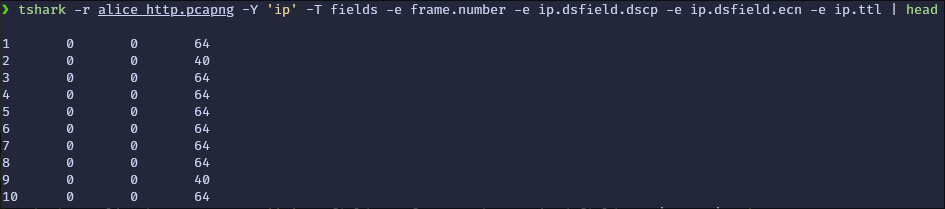

### ii. ¿La transmisión soporta ECN?

No. El campo ECN (Explicit Congestion Notification) tiene valor 0 en todos los paquetes analizados, indicando que ECN no está habilitado en esta transmisión.

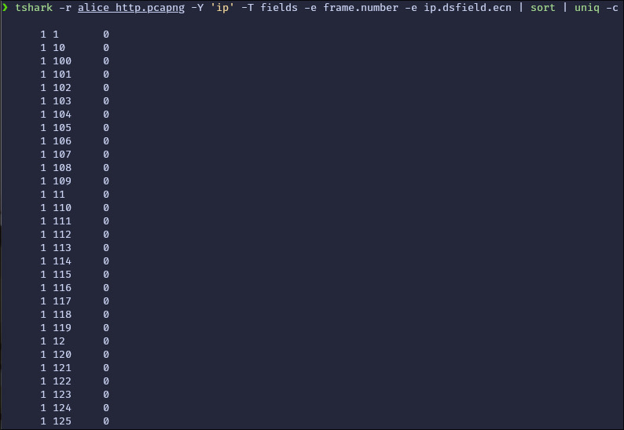

### iii. ¿Cuál es el TTL de los paquetes?

El TTL de los paquetes enviados desde nuestra máquina (192.168.1.88) es 64, mientras que los paquetes recibidos del servidor tienen TTL 40.

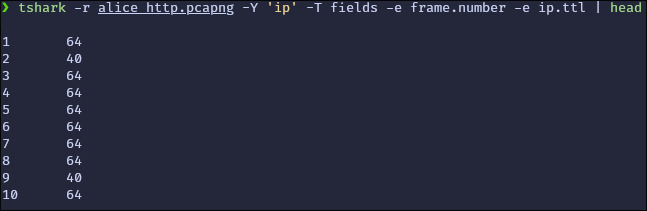

## d. ¿Cual es el sequence number del segmento que lleva el HTTP POST?

Para determinar el sequence number exacto del segmento que lleva el HTTP POST (frame 105), se necesita ejecutar:

```bash
tshark -r alice_http.pcajpg -Y 'frame.number == 105' -T fields -e tcp.seq
```
El cual me dio el resultado de la imagen:

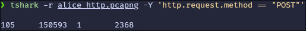

## e. ¿Qué puede observar al ver el payload de los segmentos que llevan el texto de Alicia?

El texto de Alicia se transmite en texto plano ya que es HTTP sin cifrado. Se puede leer directamente el contenido del libro en los segmentos TCP.

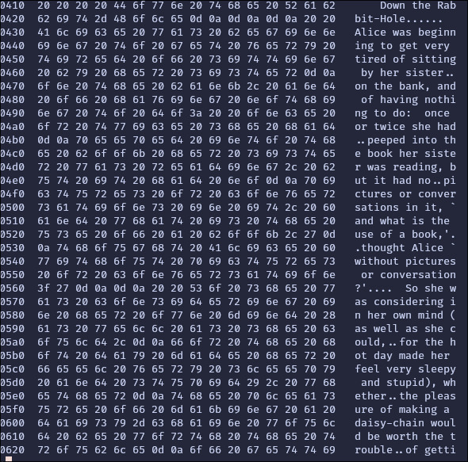

## f. ¿Encontró alguna retransmisión de paquetes?

No se encontraron retransmisiones. El último comando ejecutado no devolvió resultados, lo que indica que no hay paquetes marcados con `tcp.analysis.retransmission` o `tcp.analysis.fast_retransmission` en la captura.
No adjunto captura debido a que el comando me devolvio nada, solo un salto de linea.

## g. Cummulative Ack

Un Cumulative ACK es un mecanismo de TCP donde el receptor confirma la recepción de todos los bytes hasta cierto número de secuencia. Si se recibe el ACK número X, significa que todos los bytes hasta X-1 fueron recibidos correctamente.

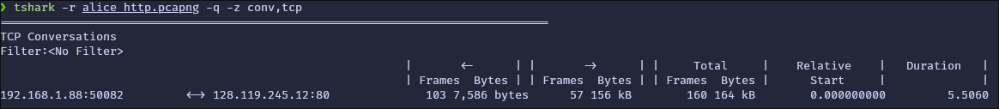

## h. Time Sequence Graph (Stevens)

El gráfico muestra un aumento rápido y constante en los números de secuencia durante el inicio de la conexión (aunque también tiene muy poca data y la resolución del gráfico es pequeña),y esto indica la fase de slow start en la que la ventana de congestión crece exponencialmente. Luego, la curva se estabiliza, mostrando que el flujo de datos alcanzó su capacidad óptima sin pérdidas visibles ni retransmisiones significativas. 
Por lo que tuvo una muy buena subida de datos sin congestión en la red.

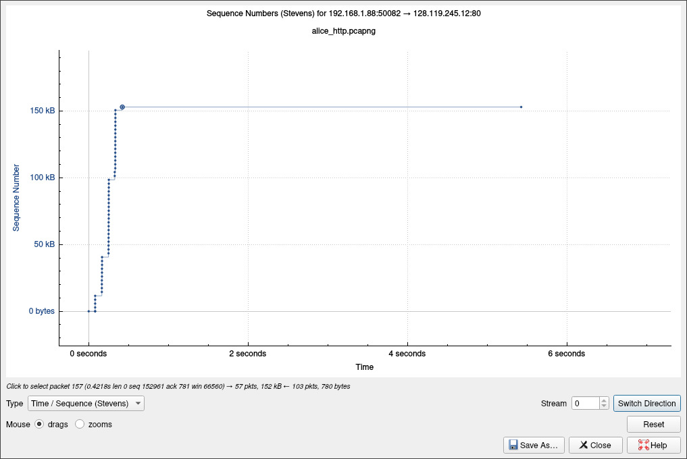

# Parte 2: Análisis de transmisión HTTPS

## a. ¿Se observa alguna diferencia al inicio de la transmisión?

Sí, se observa el proceso de TLS Handshake al inicio de la transmisión. A diferencia de HTTP simple, HTTPS requiere establecer una conexión segura mediante el intercambio de certificados y negociación de parámetros de cifrado antes de transmitir datos.

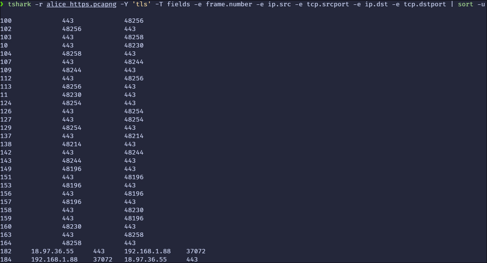

## b. ¿Qué puerto estamos usando esta vez para la transmisión?

Puerto 443, que es el puerto estándar para HTTPS. Se puede observar en las conexiones TLS capturadas que múltiples puertos efímeros locales se conectan al puerto 443 del servidor.

## c. ¿Encontró alguna retransmisión de paquetes?

No se encontraron retransmisiones en esta captura. El comando no devolvió ningún resultado, indicando que no hubo paquetes marcados con retransmisión o retransmisión rápida.

## d. ¿Encontró indicios de cumulative ack en la transmisión?

Sí, se observan cumulative ACKs en las conexiones TCP establecidas. En la tabla de conversaciones TCP se puede ver el intercambio de múltiples frames y bytes entre el cliente y servidor, donde los ACKs confirman la recepción acumulativa de datos.

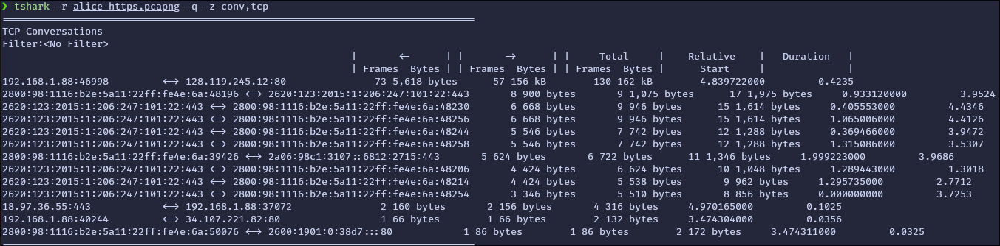

## e. ¿Hacia qué IP y puerto estamos enviando el archivo? ¿Qué nota de extraño?

IP destino: 128.119.245.12
Puerto destino: 80

Lo extraño es que se está usando el puerto 80 (HTTP) en lugar del puerto 443 (HTTPS), a pesar de que la URL indica HTTPS. Esto dice que el formulario de la página está configurado incorrectamente y está enviando los datos sin cifrar aunque la página principal use HTTPS.

## f. ¿Qué puede observar al ver el payload? ¿A qué se debe?

El payload de los segmentos TLS está cifrado (content_type 23 = Application Data con versión TLS 1.2 - 0x0303). Sin embargo, si el archivo se envió por el puerto 80, los datos de Alice estarían en texto plano.

Esto se debe a que el formulario HTML tiene un atributo `action` que apunta a una URL HTTP en lugar de HTTPS, causando que el navegador envíe los datos sin cifrar independientemente de que la página actual sea HTTPS.

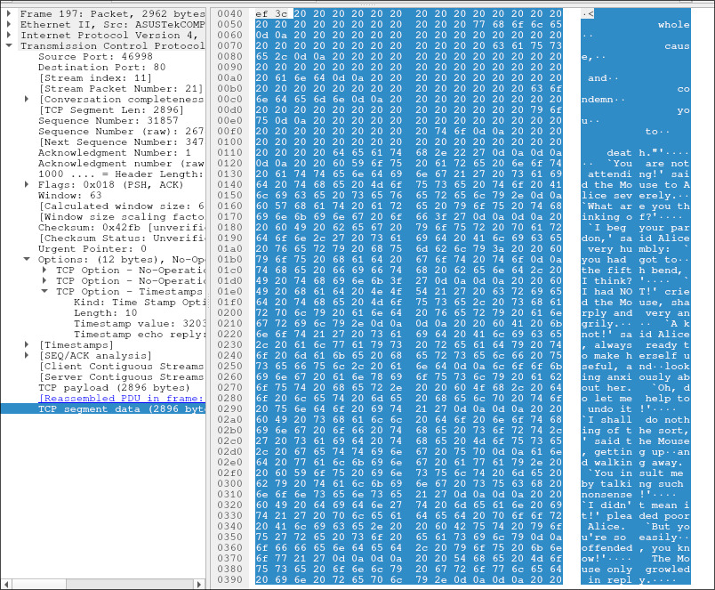

## g. Transmisión corregida (HTTPS completo)

Para corregir el codigo de la pagina, hice lo siguiente:

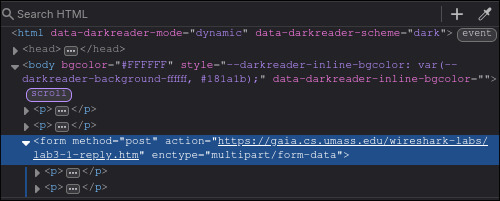

### i. ¿Qué diferencia puede observar ahora al inicio de la conexión?

Ahora se observa que toda la comunicación, incluyendo el POST del archivo, ocurre sobre el puerto 443 con TLS Handshake completo. La conexión es completamente cifrada desde el inicio.

### ii. ¿Qué puede observar ahora al ver el payload?

El payload ahora está completamente cifrado. Los segmentos que llevan el texto de Alice son datos de aplicación TLS (tipo 23) cifrados, imposibles de leer sin las claves de sesión. No se puede observar el contenido del libro en texto plano.

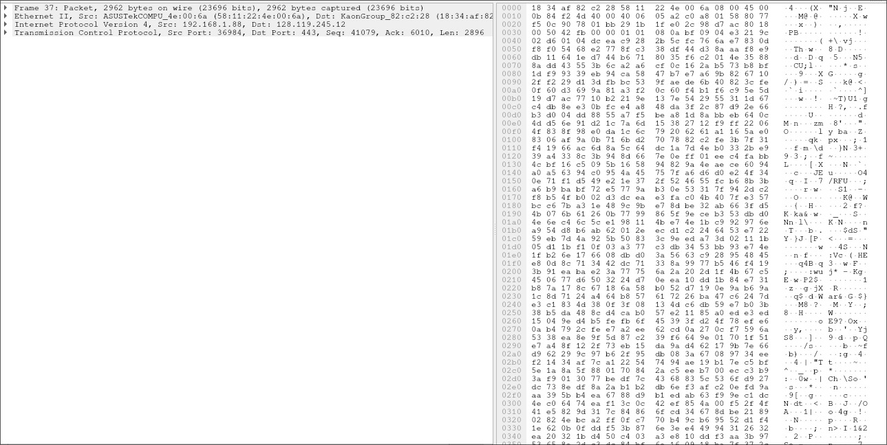

### iii. Importancia de cifrar datos

Aprendi que cuando uso HTTP, los datos viajan en texto plano, cualquier intermediario puede leer el contenido completo. Para mitigar esto, puedo usar HTTPS, pero si lo uso mal, como la página https sin corregir, un formulario con action HTTP puede exponer los datos.
Mientras que usar HTTPS bien configurado, si asegura que todo el tráfico está cifrado, protegiendo la integridad de los datos.


**Nota**

- La captura de http se llama `alice_http.pcapng`
- La captura inicial de https se llama `alice_https.pcapng`
- La captura corregida de https se llama `alice_https_corregido.pcapng`

Puede que el puerto de la captura subida de http haya cambiado, por que cuando corrí los mismos comandos de captura, sobreescribí mi captura inicial http y me di cuenta cuando ya habia terminado la primera captura https, asi que repeti ambas capturas :(
